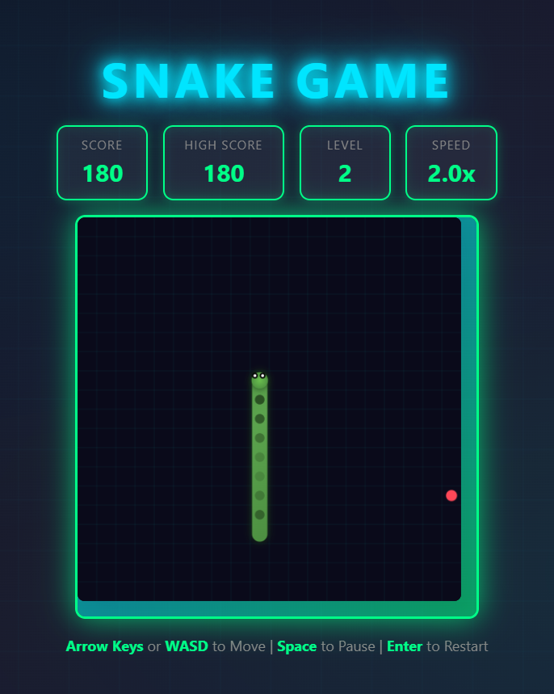

# Snake Game 🐍

A modern, feature-rich Snake game built with HTML Canvas, CSS, and JavaScript.

## Screenshot

## Features

- **Classic Gameplay** - Eat food, grow longer, avoid walls and your own tail
- **Multiple Difficulty Levels** - Easy, Medium, Hard, and Expert modes
- **Level Progression** - Level increases every 100 points with increasing speed
- **Special Foods** - Golden food (bonus points) and freeze food (temporary speed reduction)
- **Achievements System** - Unlock achievements as you play
- **Statistics Tracking** - Track games played, best score, foods eaten, and more
- **Sound Effects** - Audio feedback for eating food and game over
- **Responsive Design** - Works on desktop and mobile devices
- **Mobile Controls** - Touch/swipe controls and D-pad for mobile gaming
- **Settings** - Customize difficulty, sound, and volume

## How to Play

### Desktop Controls

- **Arrow Keys** or **WASD** - Move the snake
- **Space** - Pause/Resume game
- **Enter** - Start/Restart game

### Mobile Controls

- **Swipe** - Move the snake
- **D-Pad** - Alternative touch controls
- **Pause Button** - Pause/Resume game

### Objective

Eat the red food to grow longer and score points. Don't hit the walls or your own tail!

### Scoring

- Each food eaten: 10 points × current level
- Golden food: 50 bonus points
- Level up: Every 100 points

## Technologies Used

- HTML Canvas
- CSS (Modern animations and responsive design)
- JavaScript (Game logic)

## Live Demo

Play the game online: [Snake Game Live Demo](https://ujjwalnepal11.github.io/snake-game)

## License

MIT License
